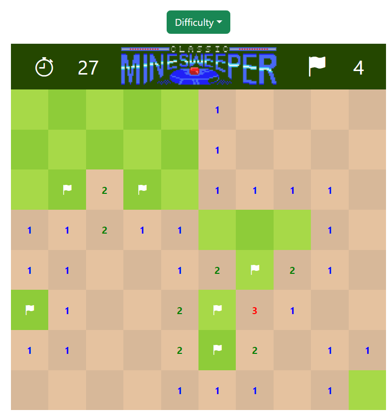
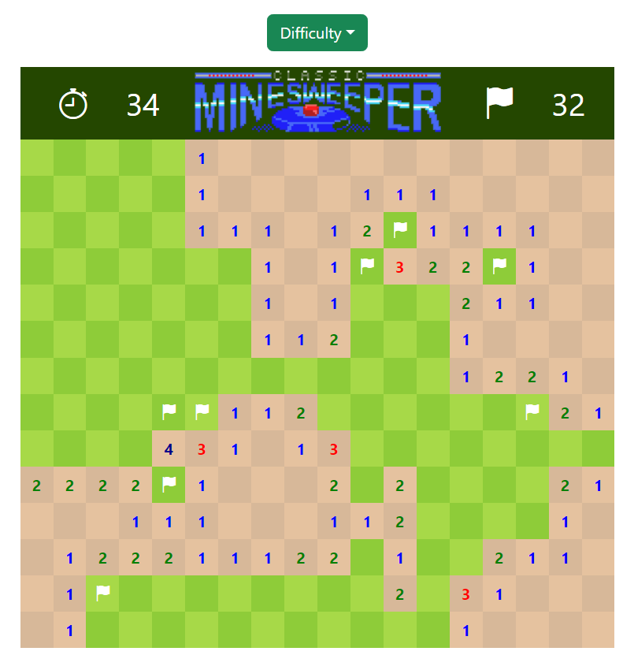
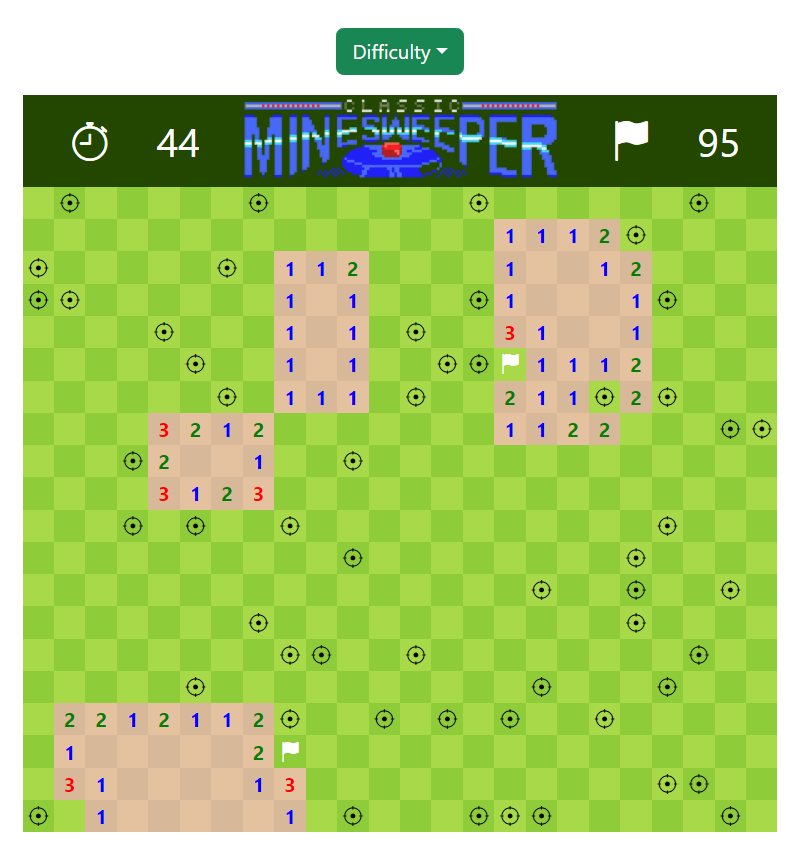

<h1 align="center">
   
  
   
  Minesweeper
   
</h1>

<h4 align="center">Classical minigame implementation</h4>

  <a href="#key-features">Key Features</a> •
  <a href="#demo">Demo</a> •
  <a href="#stack">Stack</a> •
  <a href="#future-improvements">Future improvements</a> •
  <a href="#views">Views</a>
   
  <a href="#support">Support</a> •
  <a href="#you-may-also-like">You may also like...</a>

## Key Features

* Minigame inspired on the classical minesweeper minigame
* Right click to set flags preventing to click into mines, and a counter to controll the flags respect the total mines amount
* Regenerated field with restart and reboot of page
* Timer to know how much time you spend in a game
* Difficulty selector from easy to hard, changing field and mines involved

## Demo

You can try the [demo](https://cariblagit.github.io/Minesweeper/) the latest version of Minesweeper for your explorer.

## Stack

 

## Future improvements

✅ Possibility to choose difficulty levels (increase and decrease size of field)
 
⬜ Better animations to win and loose
 
✅ Timer and flags counter implementation
 
⬜ Pallette selector for changing default colors

## Views

Example ingame - Easy mode example

Example ingame - Normal mode example

Example ingame - Hard mode loosing

## Support

## You may also like...

- [Between Sins](https://gitlab.com/daghdha1/betweensins) - RPG videogame 
- [Mars Alienated](https://gitlab.com/AdrianGarciaAndreu/mars-alienated-rv-htc) - VR escape room experience in a space station

